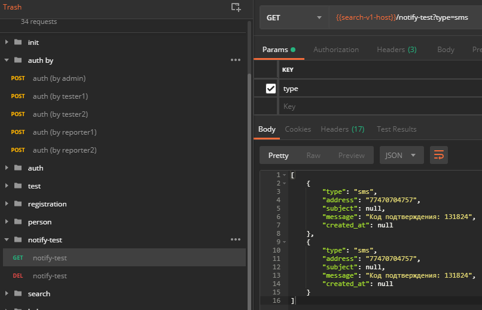

Получение СМС-кода на тестовом
===

Для получения СМС-кода на тестовом API-сервере, необходимо:

* открыть Postman
* авторизоваться под админом
* запросить список СМС (/notify-test?type=sms)

Новые СМС находятся вверху списка.

> Note: На боевом это не работает и не должно работать.